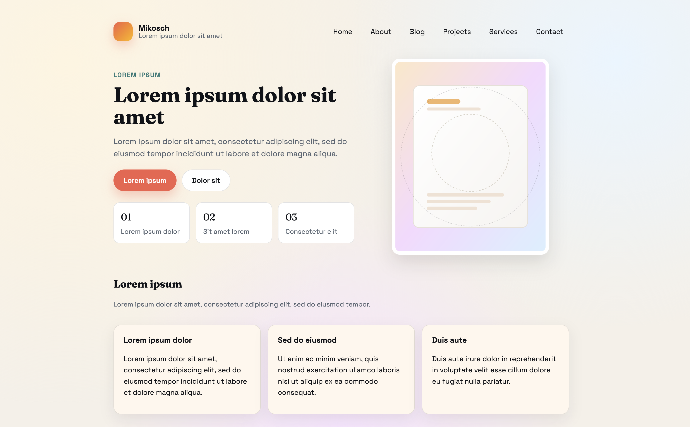

# Mikosch

## Overview



Mikosch is a warm, editorial Hugo theme with bold serif headlines, soft gradients, and spacious cards. It is designed for personal portfolios, studios, and story-driven blogs.

## Quickstart

Requirements:
- Hugo 0.80+ (extended recommended)

Install:

```bash
git submodule add <repo-url> themes/mikosch
```

Then set the theme in your site config:

```toml
theme = "mikosch"
```

Run the local server:

```bash
hugo server -D --themesDir themes
```

## Licence

Mikosch is licensed under the MIT license.
